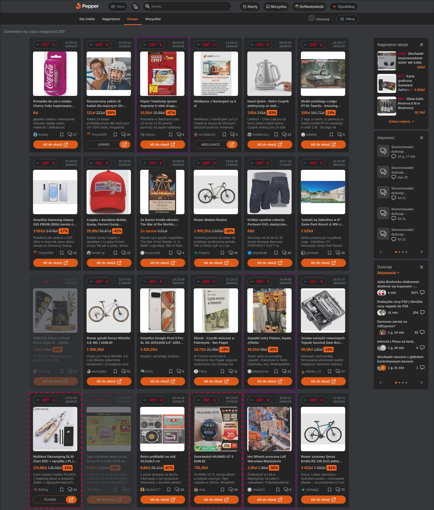

# PepperTweaker

Czyli Pepper na resorach :)

Jest to darmowe i otwartoźródłowe rozszerzenie do serwisu Pepper, które wzbogaca platformę o dodatkowe funkcjonalności niedostępne w wersji oficjalnej. Na chwilę obecną obsługiwany jest tylko polski serwis Pepper.pl, ale niebawem zostanie dodane wsparcie pozostałych domen Peppera.

## Spis treści

* [Słowem wstępu](#słowem-wstępu)
* [Instalacja](#instalacja)
* [Funkcje PepperTweakera](#funkcje-peppertweakera)
  * [Przywrócenie widoku siatki (widoku kafelkowego/kompaktowego etc.)](#przywrócenie-widoku-siatki-(widoku-kafelkowego/kompaktowego-etc.))
  * [Ciemny motyw](#ciemny-motyw)
  * [Filtrowanie okazji](#filtrowanie-okazji)
  * [Filtrowanie komentarzy](#filtrowanie-komentarzy)
  * [Przyciski polubienia najlepszych komentarzy](#przyciski-polubienia-najlepszych-komentarzy)
  * [Powiększanie miniaturek obrazków](#powiększanie-miniaturek-obrazków)
  * [Opcja kalendarza](#opcja-kalendarza)
  * [Interfejs wyszukiwania](#interfejs-wyszukiwania)
  * [Automatyczne odświeżanie widoku ofert i komentarzy](#automatyczne-odświeżanie-widoku-ofert-i-komentarzy)
  * [Podgląd komentarzy na stronie profilu](#podgląd-komentarzy-na-stronie-profilu)
  * [Ulepszone odnośniki do komentarzy](#ulepszone-odnośniki-do-komentarzy)
  * [Poprawione linki](#poprawione-linki)
* [Zapis i odczyt ustawień](#zapis-i-odczyt-ustawień)
* [Uwagi końcowe](#uwagi-końcowe)

## Słowem wstępu

PepperTweaker to projekt hobbystyczny, który powstał w celu polepszenia i dodania nowych funkcjonalności do Peppera. Nie jestem pracownikiem Peppera a skrypt powstał i jest aktualizowany dzięki poświęceniu sporej ilości wolnego czasu, więc proszę o uszanowanie tego i nie podchodzenie w sposób roszczeniowy :).

**Dla pewności ostrzegam:
Nie ponoszę żadnej odpowiedzialności za korzystanie z rozszerzenia oraz nie gwarantuję jego działania, ani że będę go w przyszłości rozwijał.**

Skrypt działa tylko w przeglądarce (nie działa w aplikacji).

W razie pytań lub problemów zajrzyj do tej dyskusji:
[PepperTweaker, czyli Pepper na resorach :)](https://www.pepper.pl/dyskusji/peppertweaker-beta-testy-188008).

Jeśli masz obawy odnośnie prywatności, to zajrzyj do sekcji [Uwagi końcowe](#uwagi-końcowe).

## Instalacja

1. Do korzystania z rozszerzenia potrzebny jest jeden z pluginów do przeglądarki, umożliwiających uruchamianie skryptów JS na stronach internetowych. Do wyboru właściwie są trzy:
    * [Tampermonkey](https://www.tampermonkey.net/) - największa kompatybilność z PepperTweakerem, ponieważ sam z niego korzystam;
    * [Greasemonkey](https://www.greasespot.net/) - ojciec wszystkich tego typu pluginów, ale podobno już rzadko aktualizowany;
    * [Violentmonkey](https://violentmonkey.github.io/get-it/) - najnowszy plugin, który jest open source, a zatem bardzo ciekawa alternatywa, ale nie miałem czasu jeszcze się temu przyjrzeć; **uwaga:** jeśli masz problem z działeniem Tweakera pod Violentmonkey zmień parametr `@run at` na wartość `document-body` (linia 8) i zerknij do tego wątku:
    [Not working on Violentmonkey #1](https://github.com/PepperTweaker/PepperTweaker/issues/1).

2. Po zainstalowaniu jednego z pluginów przechodzisz na [stronę skryptu PepperTweaker w serwise GreasyFork](https://greasyfork.org/en/scripts/390341-peppertweaker) i klikasz zielony przycisk "Zainstaluj skrypt":\

I gotowe! Od teraz możesz cieszyć się nową funkcjonalnością na Pepperze!

## Funkcje PepperTweakera

### Ważna uwaga!

**Część funkcji może już nie działać lub działać w inny sposób.** Ekipa tworząca Peppera wprowadza dużo zmian i niestety nie ze wszystkim nadążamy (w tym z odświeżaniem tego opisu).

Priorytetem jest jednak utrzymanie **widoku siatki, filtrowania ofert oraz ciemnego motywu** - na to można zawsze liczyć. Najświeższe informacje odnośnie aktualizacji znajdują się w linkowanej już wyżej dyskusji na Pepperze: [PepperTweaker, czyli Pepper na resorach :)](https://www.pepper.pl/dyskusji/peppertweaker-beta-testy-188008).

### Zakładka z ustawieniami

Do zarządzania Tweakerem służy GUI dobudowane do Peppera w sekcji ustawień.
Link jest dynamiczny i zależy od nazwy użytkownika, ale ogólna postać jest następująca:\
https://www.pepper.pl/profile/[NAZWA_UŻYTKOWNIKA]/settings#peppertweaker

Funkcje i zakładka ustawień zmienia się co jakiś czas, więc w aktualnej wersji może wyglądać nieco inaczej.

### Przywrócenie widoku siatki (widoku kafelkowego/kompaktowego etc.)

Opcja domyślnie włączona, która powoduje podmianę widoku listy na stary dobry widok siatki ;) Jeśli wolisz listę, możesz wyłączyć tę opcję na stronie ustawień.

Aktualny wygląd siatki:

### Ciemny motyw

Jak widać na innych zrzutach ekranu, jest możliwość ustawienia wyświetlania Peppera w ciemnym motywie. Opcja jest domyślnie włączona, ale motyw można zmieniać w ustawieniach oraz za pomocą przycisku znajdującego się obok paska wyszukiwania:

### Filtrowanie okazji

Jedna z pierwszych funkcji jaka została dodana do Tweakera, a w zasadzie była impulsem, dzięki któremu rozszerzenie powstało. Wiele osób pytało o możliwość filtracji okazji, ale niestety takiej funkcjonalności nie mogliśmy doczekać się na Pepperze.

Mechanizm filtrowania jest dosyć rozbudowany i pozwala na ustawienie praktycznie dowolnych warunków "łapania" okazji. Bazowym zamysłem jest oczywiście ukrywanie niechcianych okazji, ale dzięki możliwości podania dowolnego stylu CSS, okazje można podświetlać, robić przezroczyste, obramowywać itp.

Domyślnie ustawionych jest kilka filtrów dodających obramowanie do pewnych okazji, więc jeśli dziwią Cię kolorowe ramki, to jest to zasługa właśnie tychże filtrów. Możesz je usunąć lub dezaktywować na stronie ustawień.

Warunki ustawiane w filtrze są ze sobą łączone, tj. jeśli podasz słowo kluczowe **buty** oraz w miejsce użytkownika wstawisz **Jeżew** i dodatkowo w stylu zaznaczysz **ramkę**, oznaczać to będzie, że wszystkie okazje ze słowem buty wstawione przez użytkownika Jeżew zostaną otoczone ramką o wybranym kolorze.

Warto jeszcze zaznaczyć, że wszystkie warunki z polami tekstowymi akceptują wyrażenia regularne, więc można poprawić powyższy filtr, aby akceptował również słowo butów i but, wpisując np.:\
**buty|butów|but**\
lub nawet prościej:\
**but(y|ów)?**

Do skryptu zostały dołączone przykładowe filtry, w których można sprawdzić sobie przykłady wyrażeń regularnych.

Aby dodać nowy filtr, z rozwijanego menu należy wybrać "Utwórz nowy..." a następnie podać warunki, które nas interesują. Po ustawieniu parametrów na końcu zatwierdzamy filtr klikając zielony przycisk "Zapisz filtr" - dopiero po tej czynności filtr zostanie zapisany w pamięci przeglądarki.

Aby dezaktywować filtr (bez usuwania go) wystarczy odhaczyć opcję "Filtr aktywny" i zapisać za pomocą przycisku "Zapisz filtr".

W polu tekstowym stylu można podać dowolny styl CSS **w formacie JSON**. Jeśli nie wiesz jak to wygląda, zaznacz ramkę i przezroczystość, co spowoduje wpisanie odpowiadającego CSS w formacie JSON w pole tekstowe.

Obecna część ustawień dotyczących filtrów okazji wygląda następująco:

### Filtrowanie komentarzy

Bardzo podobna funkcja do filtrowania okazji, z tym że dotyczy filtrowania komentarzy. Możemy np. ukryć komentarze zawierające brzydkie słowa lub komentarze danego użytkownika.

Domyślnie włączony jest tylko jeden filtr, który powoduje wyróżnianie zieloną ramką moich komentarzy :D. Dla przykładu zostały jeszcze dodane dwa inne, ale nie są aktywne.

Obecna wersja ustawień dotyczących filtrów okazji jest następująca:

### Przyciski polubienia najlepszych komentarzy

Których nie ma oficjalnie, nie wiedzieć czemu ;).

### Powiększanie miniaturek obrazków

Kliknięcie w miniaturkę obrazka powiększa go, zamiast przenosić na stronę okazji. Działa zarówno na obrazki w szczegółach okazji, jak i na widoku zbiorczym okazji.

### Opcja kalendarza

Dodawanie powiadomień o okazji do kalendarza Google. Po kliknięciu ikony kalendarza otworzy się strona Google Calendar, w której większość pól (jak data rozpoczęcia okazji) będzie już wypełniona :).

### Interfejs wyszukiwania

Umożliwia wyszukiwanie w popularnych serwisach, sklepach, porównywarkach cen itp.

W celu skorzystania z wyszukiwarki po prostu zaznacz jakiś fragment tekstu na stronie a następnie kliknij ikonkę serwisu, w którym chcesz wyszukać zaznaczony fragment.

Dodatkowo na stronie wyszukiwarki Pepperowej pojawia się przycisk przeszukujący Peppera za pomocą Google:

A tu wynik po kliknięciu w przycisk:

### Automatyczne odświeżanie widoku ofert i komentarzy

Jest to funkcja eksperymentalna i może jeszcze zawierać błędy.

Pozwala na włączenie obserwowania listy ofert lub komentarzy pod okazją oraz automatyczne ładowanie ich bez odświeżania się strony. Dodatkowo możliwe jest włączenie powiadomienia dźwiękowego w przypadku pojawienia się nowej okazji lub nowego komentarza.

### Podgląd komentarzy na stronie profilu

Na stronie profilu dowolnego użytkownika (nie tylko naszej) ładowany jest pogląd komentarzy w celu łatwiejszego znalezienia odpowiedniego wpisu.

### Ulepszone odnośniki do komentarzy

Po kliknięciu lewym przyciskiem myszy w datę komentarza lub przycisk "Permalink" otworzy się nowa karta z odpowiednim linkiem do komentarza. Ponadto usunięty został modal (okienko), które pojawiało się po kliknięciu w "Permalink", zatem aby skopiować link, wystarczy teraz kliknąć prawym przyciskiem myszy i wybrać odpowiednią opcję z menu kontekstowego.

### Poprawione linki

Pewnie każdy choć raz trafił na źle otwierający się link w komentarzu lub opisie oferty. W Tweakerze jest na to mała poprawka, która powinna temu zapobiec :).

## Zapis i odczyt ustawień

Wszystkie ustawienia PepperTweakera zapisane są w pamięci przeglądarki. Jeśli chcesz przenieść ustawienia (w tym filtry itp.) na inny komputer (czy nawet inną przeglądarkę), to musisz skorzystać z opcji eksportu ustawień do pliku, która znajduje się na stronie ustawień Tweakera.

**UWAGA:** Zaleca się robienie kopii zapasowych ustawień przynajmniej przed każdą aktualizacją skryptu. Dodatkowo, jeśli wyczyścisz dane przeglądarki, utracisz wszystkie ustawienia, zatem przed każdą taką operacją wyeksportuj ustawienia po pliku, aby mieć możliwość ich ponownego wczytania.

## Uwagi końcowe

Jak widać po opcji zapisywania ustawień, skrypt PepperTweakera nie wysyła żadnych informacji o użytkowniku na żadne serwery. Wszystko przechowywane jest lokalnie z poszanowaniem prywatności jego użytkowników :).
